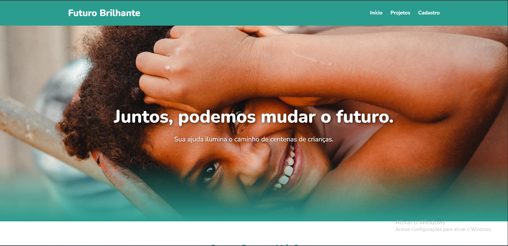
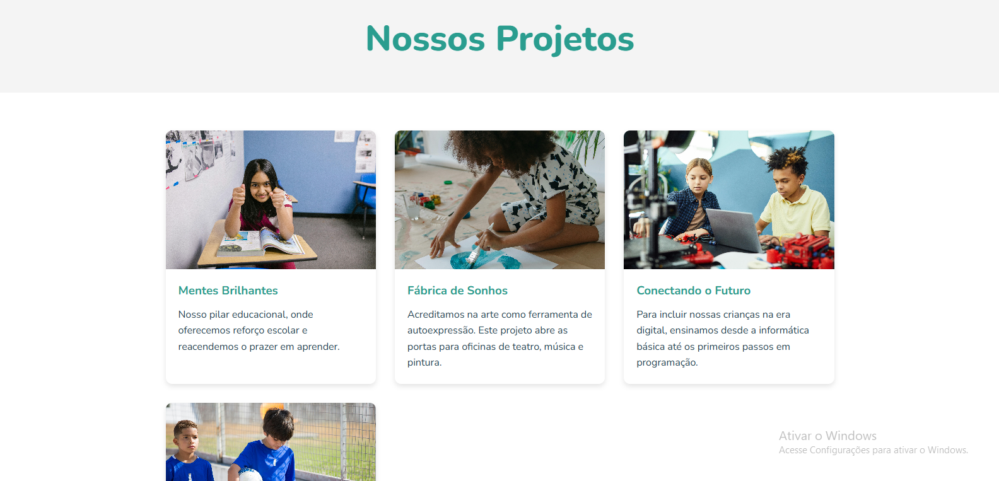
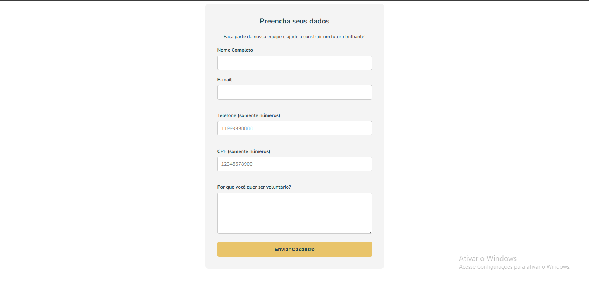

# 🚀 Projeto ONG "Futuro Brilhante" (Versão Angular)


Projeto de estudo para a criação de um site institucional para uma ONG fictícia. O projeto foi originalmente construído com HTML, CSS e JS puro, e posteriormente **refatorado para uma Single Page Application (SPA) completa utilizando o framework Angular 18+**.

O foco foi migrar um site estático para uma arquitetura moderna baseada em componentes, implementando roteamento, formulários reativos e práticas profissionais de desenvolvimento front-end.

---

## 📸 Visualização do Site

Abaixo estão algumas capturas de tela das principais páginas do projeto, demonstrando o layout e o design responsivo.

### Página Inicial
*Uma visão completa da organização, com seção hero, missão, visão e valores.*


### Página de Projetos
*Uma galeria em grid apresentando os projetos da ONG de forma clara e organizada.*


### Página de Cadastro de Voluntários
*Um formulário limpo e funcional com validação de dados em tempo real.*



---

## ✨ Funcionalidades Principais

- **Arquitetura SPA (Single Page Application):** O site carrega uma única vez. A navegação entre as páginas é instantânea e gerenciada pelo **Roteador do Angular**, sem novos carregamentos.
- **Arquitetura Baseada em Componentes:** Todo o layout foi "quebrado" em componentes reutilizáveis (`Header`, `Footer`, `CardProjeto`), utilizando a arquitetura `standalone` do Angular.
- **Formulários Reativos (Reactive Forms):** O formulário de cadastro foi reconstruído com o `FormBuilder` do Angular, permitindo:
    - Validações robustas diretamente no TypeScript.
    - Verificação de formato de e-mail e telefone (`Validators`).
    - **Validador customizado para CPF**, que verifica a matemática real do documento.
- **Design Totalmente Responsivo:** O layout se adapta perfeitamente a desktops, tablets e celulares, utilizando CSS Flexbox, Grid Layout e Media Queries.
- **Menu Hambúrguer Funcional:** Implementado com TypeScript para controlar o estado (aberto/fechado) em dispositivos móveis.

---

## 💻 Tecnologias Utilizadas

Este projeto foi construído utilizando as seguintes tecnologias:

- **Angular (18+):** O framework principal para construir a SPA.
    - **Angular CLI:** Para geração de componentes, build e execução do projeto.
    - **Angular Router:** Para o roteamento e navegação da SPA.
    - **Reactive Forms:** Para a construção e validação dos formulários.
    - **Componentes Standalone:** Arquitetura moderna para componentes independentes.
- **TypeScript:** A linguagem principal para toda a lógica da aplicação, validações e interatividade.
- **CSS3:** Para toda a estilização, responsividade e layouts, com uso intensivo de:
    - `Flexbox`
    - `Grid Layout`
    - `Media Queries`
    - `Variáveis CSS`
- **HTML5:** Para a estruturação semântica dentro dos templates dos componentes.

---

## 🚀 Como Executar o Projeto

Este projeto utiliza o ecossistema Angular. Você precisará do Node.js e do Angular CLI instalados na sua máquina.

1. **Clone o repositório:**
   ```bash
   git clone [https://github.com/Rodrigoyu/ong-futuro-brilhante-angular.git](https://github.com/Rodrigoyu/ong-futuro-brilhante-angular.git)
   ```
2. **Navegue até a pasta do projeto:**
   ```bash
   cd ong-futuro-brilhante
   ```
3. **Instale as dependências (pacotes do Node):**
   ```bash
   npm install
   ```

4. **Execute o servidor de desenvolvimento:**
   ```bash
   ng serve -o
   ```
O comando -o abrirá o projeto automaticamente no seu navegador, geralmente em http://localhost:4200/.

E pronto! Você poderá navegar por todas as páginas do site.

---

## 👨‍💻 Autor

Desenvolvido por **José Rodrigo**.

- **GitHub:** [Rodrigoyu](https://github.com/Rodrigoyu)
- **LinkedIn:** [José Rodrigo](https://www.linkedin.com/in/jose-rodrigo-silva-sena/)
